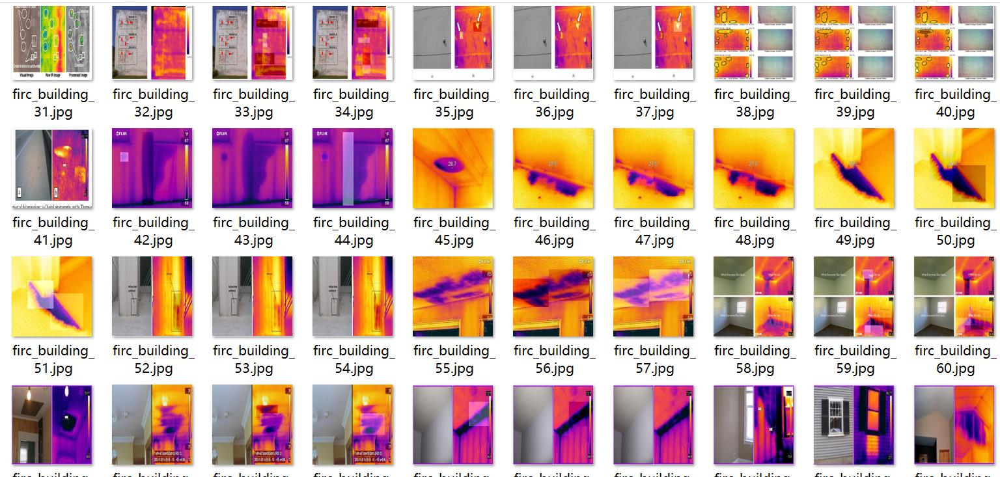
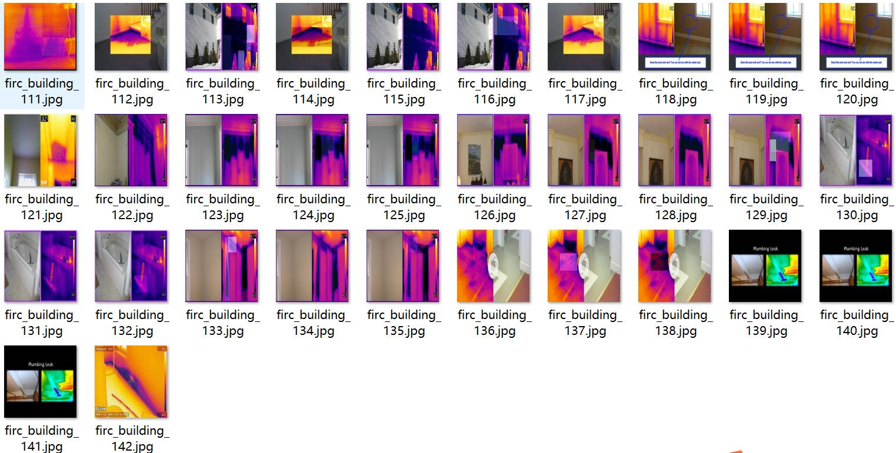
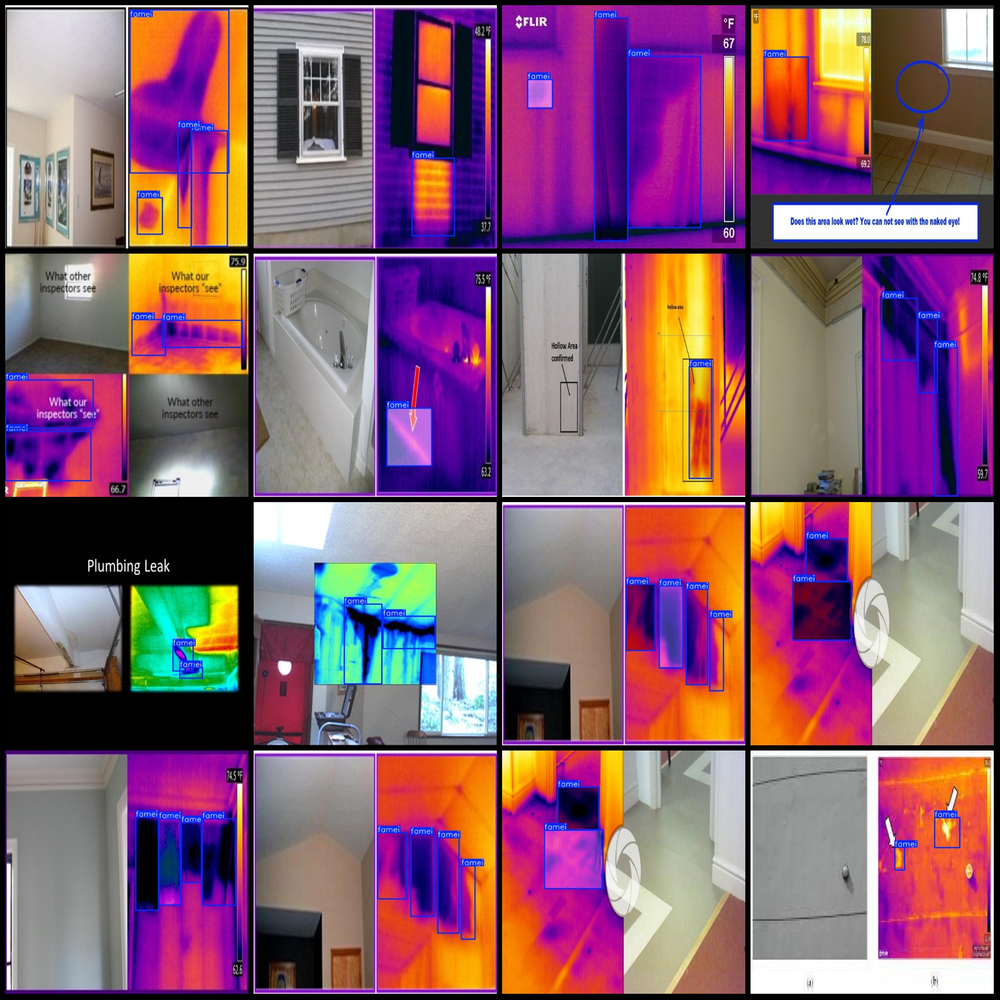
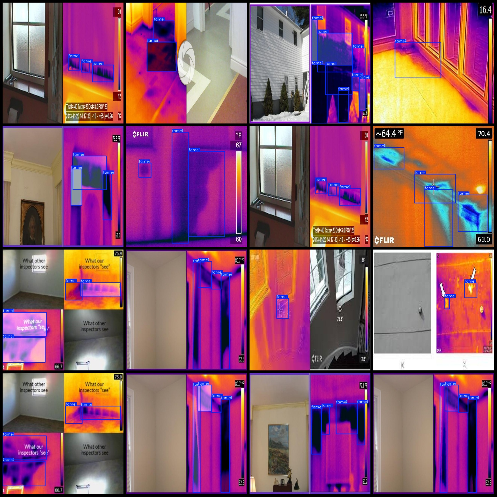

# Infrared Image Wall Mold Detection Dataset VOC+YOLO with 142 Images in 1 Class, Enhanced

Dataset format: Pascal VOC format + YOLO format (excluding split path in txtfile, only including jpgimage and corresponding VOC format xmlfile and yolo format txtfile)
number of images: 142  
annotation count: 142  
annotation count: 142  
annotationnumber of classes: 1  
annotation class names:["famei"]  
boxes per class:   
The box count of famei (mold) is 456.
total boxes: 456  
image resolution: 640x640  
Using the annotation tool: labelImg,
Annotation rules: draw a rectangle around the class.
Important notes: Dataset1/3 is the original image with the remaining enhancement image.
Special statement: This dataset does not guarantee the accuracy of the trained model or weight file.
Image preview:
## Images

Here is a pay link on Stripe ( https://buy.stripe.com/3cs8yP7sY87d0vu9AB ). Please contact me lonlonago@foxmail.com after funding $89, and I will send you a complete data files , thank you!

